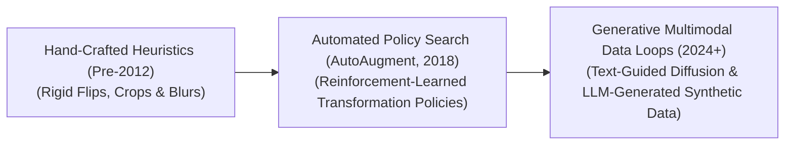
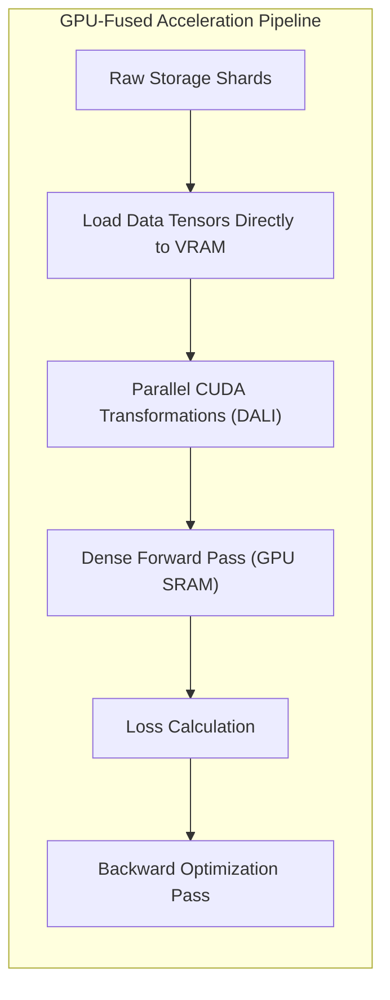

# Awesome-Data-Augmentation
## Data Augmentation in AI: History, Progression, Variants, & Applications

Data Augmentation is a hardware-aware data engineering and regularization paradigm designed to artificially expand the size, diversity, and structural variation of a training dataset without physically collecting new raw samples. By applying programmatic transformations—such as geometric warps, color space shifts, semantic pixel mixing, or generative text mutations—to existing data points, Data Augmentation artificially multiplies the available data matrix. This prevents deep neural networks from memorizing superficial training patterns (overfitting), instills crucial structural invariants (like translation and scale invariance), and smooths out the network's loss landscape to safeguard downstream model generalization.

---

## 1. The Macro Chronological Evolution

The technical methodology of dataset expansion has transitioned from hand-crafted geometric transformations to automated policy-search routines and modern multi-modal generative synthesis loops.

*   **The Hand-Crafted Heuristic Era (Traditional Vision & ML, Pre-2012)**
    *   *Concept:* The structural baseline popularized during the dawn of Convolutional Neural Networks (CNNs). AlexNet (2012) cemented this phase by using simple, low-cost CPU-driven mathematical pixel shifts—such as random horizontal flipping, scaling variations, and localized canvas cropping—to expand ImageNet categories artificially.
    *   *Limitation:* Highly rigid and manual. Developers had to guess which specific geometric rules fit a task, risking accidental semantic corruption (e.g., vertically flipping a car photo creates a physically impossible scene that confuses early layer features).
*   **The Automated Policy Search & Pixel Mixing Era (~2018–2022)**
    *   *Concept:* Turned augmentation curation into an optimization task. Google’s **AutoAugment (2018)** used Reinforcement Learning to discover the absolute best combination, sequence, and magnitude of transformations for a specific dataset automatically. Concurrently, the field shifted toward semantic pixel-mixing transformations like **Mixup (2017)** and **CutMix (2019)**, blending distinct image classes together to force hidden layers to learn continuous decision boundaries.
*   **The Generative Multimodal Foundation Era (~2023–Present)**
    *   *Concept:* The current modern state-of-the-art framework driving foundational AI. Bypasses simple pixel manipulation by exploiting deep generative models. Computer vision stacks utilize **Denoising Diffusion Models and Flow-Matching Transformers** to execute photorealistic asset variation, altering styles, weather parameters, and lighting via text prompts. Simultaneously, Large Language Models use **Self-Instruct frameworks** to programmatically mutate instruction pairs, generating pristine synthetic reasoning text strings from small human seed pools.

---

## 2. Core Functional & Data-Modality Variants

Data Augmentation strategies are strictly categorized based on the underlying data format and the mathematical complexity of the transformation engine.

### A. Computer Vision (Pixel-Space Dynamics)
*   **Geometric Transformations:** Modifies the spatial coordinate grid of an image. Includes random cropping, affine scaling, rotations, shearing, and elastic deformations to enforce location and orientation invariance.
*   **Color Space & Pixel-Level Filtering:** Alters tensor channel values directly. Includes color jittering (modifying brightness, contrast, saturation, and hue), Gaussian blurring, and solarization to desensitize the model to variable lighting or camera sensors.
*   **Aman-Feature Vector Mixing:**
    1.  *Mixup:* Linearly interpolates two random images and their respective labels ($x = \lambda x_i + (1-\lambda)x_j$), creating hybrid training data.
    2.  *CutMix:* Cuts out a physical patch from image A and pastes it over a region in image B, adjusting target labels proportionally to the covered pixel area.

### B. Natural Language Processing (Token-Space Dynamics)
*   **Lexical Substitution (EDA / Back-Translation):** Replaces non-essential tokens using synonym lookups (WordNet) or semantic embeddings. Advanced pipelines run **Back-Translation**—translating an English phrase into French and back to English using a fast translation model to synthesize alternative grammatical structures.
*   **Generative Self-Instruct Mutations:** Utilizes high-capacity frontier language models to take a baseline instruction prompt and rewrite it across multiple alternative modalities (e.g., adding technical constraints, simplifying terminology, or converting it into an edge-case reasoning debug task).

---

## 3. Advanced Hardware-Accelerated Architecture Types

To scale data augmentation past processing throughput bottlenecks, modern engineering pipelines leverage specialized runtime execution layouts.

*   **GPU-Fused Batched Augmentation (Kornia / NVIDIA DALI)**
    *   *The Legacy Bottleneck:* Historically, data augmentation was executed sequentially on the host CPU using standard imaging libraries, passing transformed arrays over the slow PCIe bus to the GPU. This created a severe I/O bottleneck that kept GPU tensor cores running under capacity.
    *   *The Fused Solution:* Modern architectures compile the data pipeline into parallelized CUDA/Triton blocks executed directly on the GPU. Raw data tensors are loaded into VRAM once, and transformations (like batched geometric warps or color shifts) execute concurrently across fast register arrays right before the forward pass math.

*   **Test-Time Augmentation (TTA)**
    *   *Profile:* Scaling compute at the inference gate. Instead of evaluating a single test image, the system generates $N$ augmented variations of that input (e.g., slightly cropped, rotated, and brightness-shifted versions) on-the-fly. The model runs a forward pass over all $N$ options, combining and averaging the output logit vectors to deliver a highly robust, stabilized final prediction.

---

## 4. Production Engineering Challenges & Mitigations

Deploying and scaling complex data augmentation workflows across large-scale distributed training clusters introduces critical semantic corruption risks.

*   **The Semantic-Label Corruption Boundary**
    *   *The Problem:* Applying unconstrained data transformations can accidentally destroy the underlying ground-truth label of a data point. For instance, in an automated OCR billing system, aggressively rotating a document or applying intense pixel noise can transform a printed `6` into an operational `8`, training the model on completely corrupt target parameters.
    *   *Mitigation:* Implementing **Label-Preserving Constrained Policies**, mapping out specific mathematical upper bounds for transformation scales ($\epsilon$-caps) tailored exclusively to the domain rules of each operational dataset.
*   **The Data Variance Exploded Convergence Slowdown**
    *   *The Problem:* Injecting massive amounts of geometric and generative data variance can make the training dataset incredibly complex. While this protects the model against eventual overfitting, it can drastically slow down early optimization epochs, requiring significantly longer learning rate schedules to find a stable local minimum.
    *   *Mitigation:* Implementing **Curriculum Augmentation Schedules**, initiating the first few pre-training epochs over clean, un-augmented baseline data, and systematically scaling up the magnitude and complexity of the transformations as the model approaches terminal convergence.

---

## 5. Frontier Real-World AI Industrial Applications

*   **Sim-to-Real Domain Adaptation for Autonomous Humanoids & Vehicles**
    *   *Application:* Drives next-generation physical intelligence systems. Because physical real-world edge-case training logs are scarce, high-fidelity physics engines (such as NVIDIA Isaac Sim) paired with diffusion flow-matching algorithms generate synthetic scene augmentations. The pipeline introduces random variations in surface friction constants, shadow configurations, camera lens glares, and dynamic obstacles, allowing the model to adapt to real-world deployment parameters zero-shot.
*   **High-Resolution Clinical Diagnostic Imaging Verification**
    *   *Application:* Trains computer vision architectures over rare medical pathologies (e.g., micro-tumor tissues). Symmetrical encoder-decoder networks utilize non-rigid elastic deformations and color-jittering transformations to artificially scale up thin clinical datasets, conditioning networks to isolate anomalies precisely across diverse data-center hardware sensors.
*   **Robust Synthetic Curation for Multi-Modal Foundation LLMs**
    *   *Application:* Breaks through the internet human data scarcity barrier. Advanced reasoning pipelines use frontier generative engines to synthesize and mutate millions of alternative mathematical proofs, Python execution traces, and structural instruction formats, outputting pristine, self-correcting synthetic data streams to maximize token-ingestion compute optimality.

---

## References
1. Krizhevsky, A., Sutskever, I., & Hinton, G. E. (2012). ImageNet classification with deep convolutional neural networks. *Advances in Neural Information Processing Systems (NeurIPS)*, 25, 1097-1105.
2. Zhang, H., et al. (2017). mixup: Beyond empirical risk minimization. *arXiv preprint arXiv:1710.09412*.
3. Cubuk, E. D., et al. (2018). Autoaugment: Learning augmentation strategies from data. *Proceedings of the IEEE/CVF Conference on Computer Vision and Pattern Recognition (CVPR)*, 113-123.
4. Yun, S., et al. (2019). Cutmix: Regularization strategy to train strong classifiers with localizable features. *Proceedings of the IEEE/CVF International Conference on Computer Vision (ICCV)*, 6023-6032.
5. Rombach, R., et al. (2022). High-resolution image synthesis with latent diffusion models. *Proceedings of the IEEE/CVF Conference on Computer Vision and Pattern Recognition (CVPR)*.
6. Wang, L., et al. (2024). Scaling multi-task instruction text datasets via self-instruct generative data augmentation loops. *International Conference on Learning Representations (ICLR)*.

---

To advance this documentation repository, infrastructure workspace, or data-engineering deployment pipeline, consider exploring these adjacent development pathways:
* Build a **Python script using PyTorch and Kornia** illustrating how to write an automated data loading pipeline that executes a batched, GPU-accelerated CutMix transformation loop over an input tensor batch.
* Generate a **comprehensive Markdown table** explicitly comparing Hand-Crafted Heuristics, Mixup/CutMix, Automated Policy Search (AutoAugment), and Generative Diffusion/LLM Synthetics across time complexity boundaries, VRAM footprint parameters, computational training overhead, and risk of semantic label corruption.
* Establish a **performance evaluation harness using NVIDIA DALI** to profile exactly how moving a multi-scale data augmentation pipeline from host CPU threads straight into fused GPU memory slots alters the overall wall-clock token-per-second training throughput of high-concurrency cloud nodes.

***

**Proactive Repository Follow-Ups:**

To assist with your documentation repository setup, let me know how you would like to proceed by choosing one of the options below:
* I can provide a **complete Python code boilerplate using PyTorch** demonstrating how to write an automated script that calculates a continuous Mixup interpolation loss over dual targets.
* I can generate a **Markdown matrix table** tracking the explicit data-augmentation strategies, validation bounds, and scaling rules utilized by leading AI platforms to train state-of-the-art vision learners.
* I can write a detailed technical explanation focusing on **how to leverage Generative Adversarial Networks (GANs)** to execute domain-specific feature-space augmentations inside hidden layers natively.

