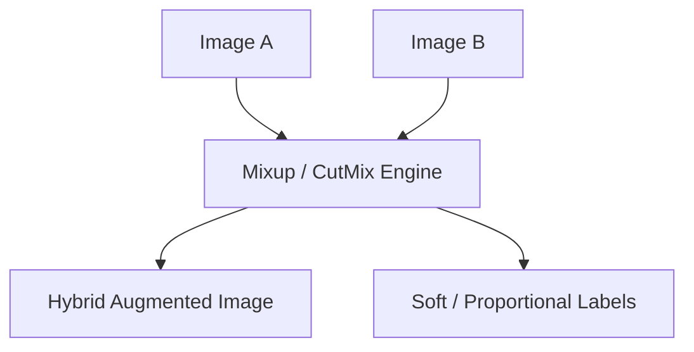

# Automated Policy Search & Pixel Mixing Era

This era turned data augmentation curation into an optimization task. Techniques like AutoAugment (2018) used Reinforcement Learning to discover optimal transform policies, while Mixup (2017) and CutMix (2019) introduced semantic pixel mixing.

### Key Techniques
- **AutoAugment:** Automated RL search for transformation policies.
- **Mixup:** Linear interpolation of image tensors and targets.
- **CutMix:** Patch-based cutting and pasting of images.

### Mermaid Diagram

[Back to README](../README.md)
