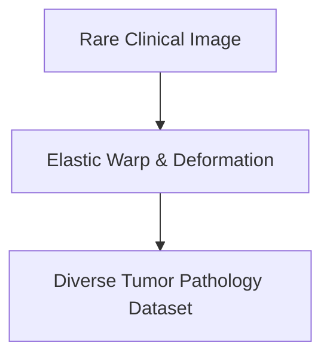

# Clinical Diagnostic Imaging Verification

Addressing data scarcity in clinical datasets (e.g., micro-tumors) via specialized transformations.

### Key Techniques
- **Elastic Deformations:** Simulating tissue variations.
- **Color-Jitter:** Simulating sensor differences.

### Mermaid Diagram

[Back to README](../README.md)
