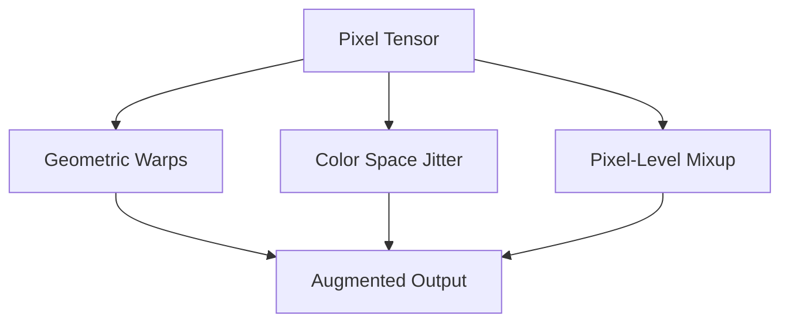

# Computer Vision (Pixel-Space Dynamics)

Pixel-Space transformations operate directly on the coordinate grids and color spaces of vision datasets.

### Key Techniques
- **Geometric:** Rotation, cropping, scaling, shearing, elastic deformations.
- **Color Space:** Jittering brightness, contrast, hue, saturation, and Gaussian blurs.
- **Feature Mixing:** Mixup and CutMix.

### Mermaid Diagram

[Back to README](../README.md)
