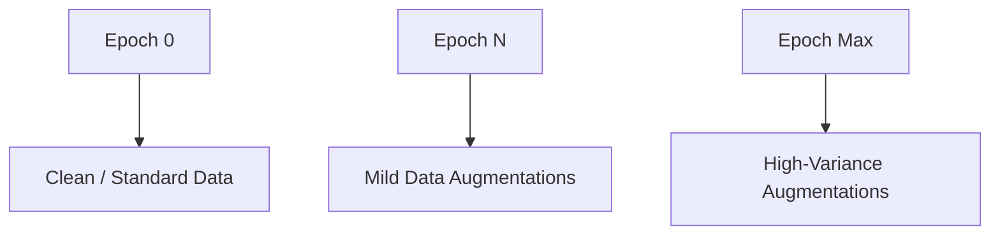

# Data Variance Exploded Convergence Slowdown

High variance in dataset patterns slows down early training optimization epochs.

### Mitigation
- **Curriculum Augmentation:** Starting with clean data and gradually scaling up augmentation magnitude.

### Mermaid Diagram

[Back to README](../README.md)
