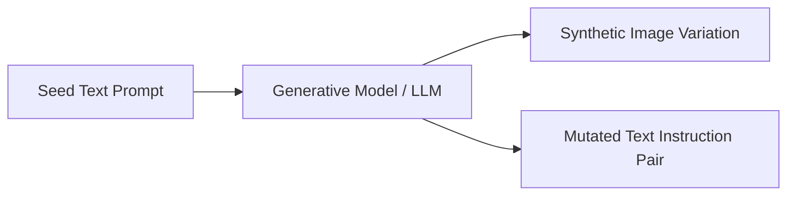

# Generative Multimodal Foundation Era

The current state-of-the-art framework driving AI, leveraging deep generative models (Diffusion Models, LLMs) to generate photorealistic asset variations and mutate textual instructions.

### Key Techniques
- **Diffusion Models:** Image-to-image prompts changing styles, lighting, or weather.
- **LLM Self-Instruct:** Programmatic mutation of prompt pairs using high-capacity LLMs.

### Mermaid Diagram

[Back to README](../README.md)
