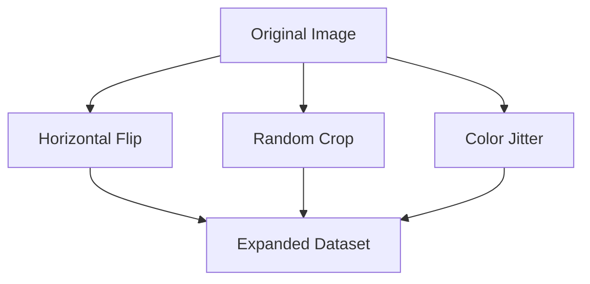

# Hand-Crafted Heuristic Era (Traditional Vision & ML)

During the dawn of Convolutional Neural Networks (CNNs), hand-crafted heuristics were the baseline for dataset expansion. This era was popularized by AlexNet in 2012, utilizing simple, CPU-driven mathematical transformations like horizontal flips, cropping, and color jitter to expand ImageNet categories.

### Key Techniques
- **Random Flipping:** Flipping images horizontally.
- **Cropping:** Extracting random patches from the image.
- **Color Space Shifts:** Modifying RGB intensities.

### Mermaid Diagram

[Back to README](../README.md)
