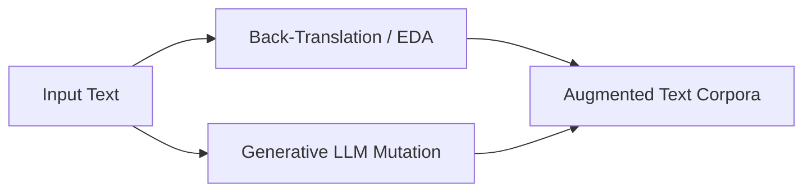

# Natural Language Processing (Token-Space Dynamics)

NLP data augmentation operates on discrete token sequences or generative contextual prompts.

### Key Techniques
- **Lexical Substitution:** EDA (Easy Data Augmentation) synonym substitution, random insertion/deletion.
- **Back-Translation:** Translating text to a foreign language and back to synthesize syntax variations.
- **Generative Mutation:** Self-instruct mutations.

### Mermaid Diagram

[Back to README](../README.md)
