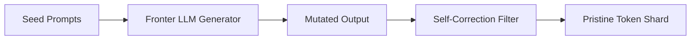

# Robust Synthetic Curation for Multi-Modal Foundation LLMs

Solving the data wall by programmatically mutating instructions, proofs, and code traces.

### Key Techniques
- **Self-Instruct Mutations:** Mutating and self-correcting synthetic data streams.

### Mermaid Diagram

[Back to README](../README.md)
