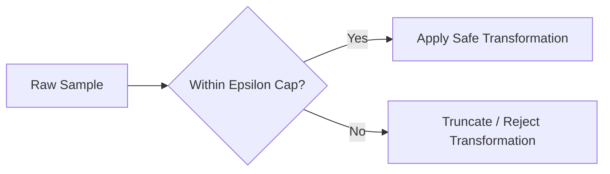

# Semantic-Label Corruption Boundary

A major challenge where aggressive augmentations alter the semantic class of the data (e.g. rotating a '6' to make it look like a '9').

### Mitigation
- **Label-Preserving Constrained Policies:** Enforcing mathematical bounds (epsilon-caps) on transformations.

### Mermaid Diagram

[Back to README](../README.md)
