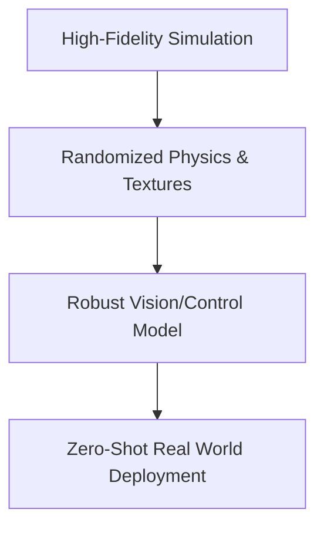

# Sim-to-Real Domain Adaptation

Closing the reality gap for robotics and physical intelligence using physics engines and domain randomization.

### Key Concepts
- **Domain Randomization:** Randomizing lighting, textures, camera positioning, and physics constants in simulation.

### Mermaid Diagram

[Back to README](../README.md)
