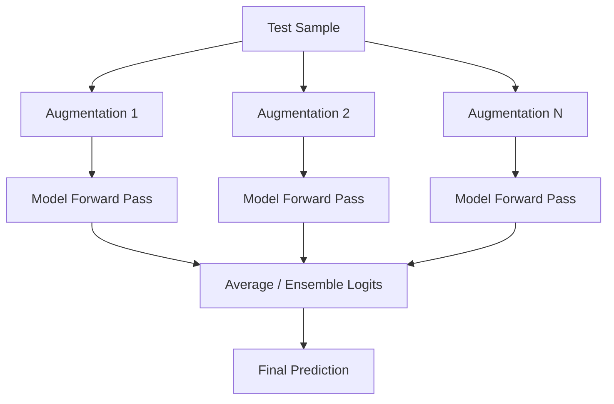

# Test-Time Augmentation (TTA)

Inference-time robustness scaling. Generates multiple transformed copies of a test input, aggregates their predictions, and computes the average logit.

### Key Flow
- Apply crops/flips to a test sample.
- Run inference on all versions.
- Vote/Average logits.

### Mermaid Diagram

[Back to README](../README.md)
